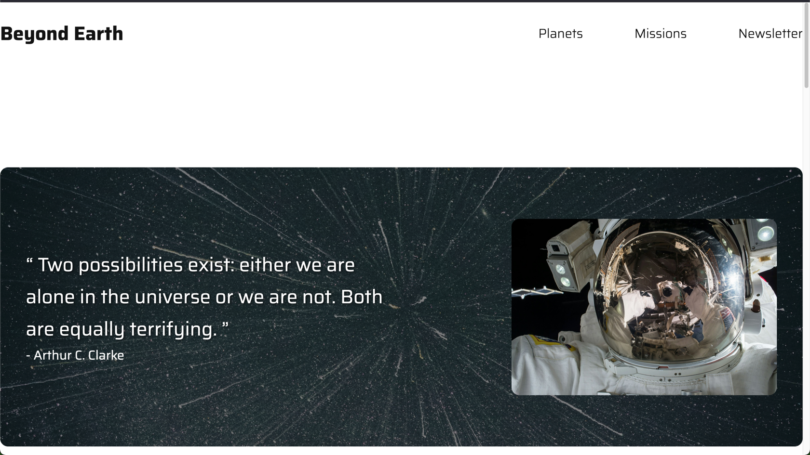
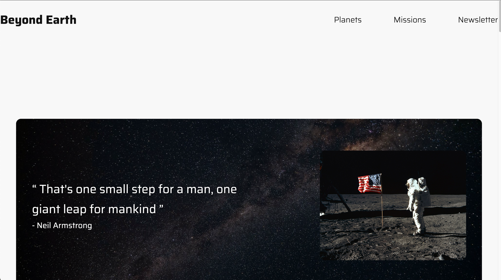
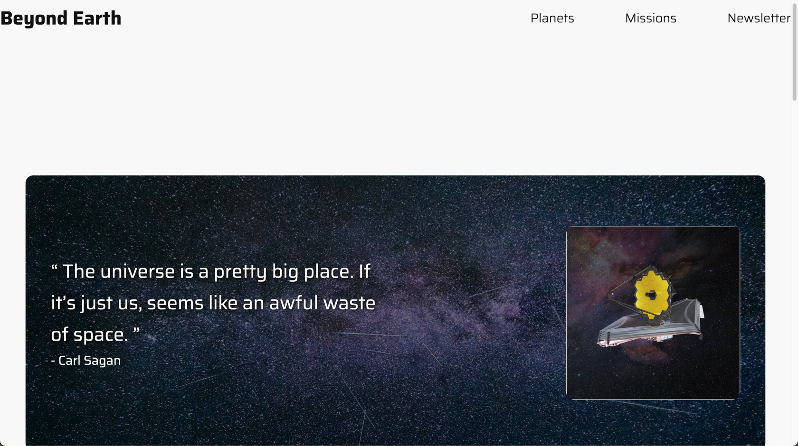
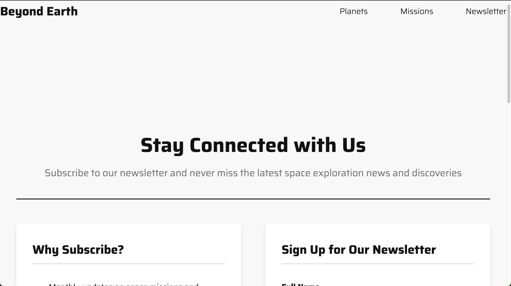

# Project Name
Space Exploration Website 🪐

### Description
This website showcases the marvelous innovation that humankind has achieved by building scientific equipment to explore the reaches outside of Earth. 
This website showcases the inventions, missions and facts we have about the planets in our Solar System. 🚀

### What Technologies are used in this Project?
- HTML
- CSS

### Website Navigation
#### Home Page
  - Successful Missions In The Last 5 Years
  - Space Organisations Facts
#### Missions Page
- The Milky Way Galaxy
  - The Sun
  - Mercury 
  - Venus
  - Earth
  - Mars
  - Jupiter
  - Saturn
  - Uranus
  - Neptune
  - Pluto
#### Planets Page
- Why Space Missions?
  - Scientific Discovery
  - Technological Advancement
  - International Cooperation
  - Inspiration and Education
#### Newsletter Page
- Stay Connected with Us
  - Why Subscribe?
  - Sign Up for Our Newsletter

### Want to Install This Project
1. Clone this project by using the following URL:
```aiignore
git clone https://github.com/himalbissessar/Build-Your-Brand-1.git
```

### How To Use
Main Page

Planets Page

Missions Page

Newsletter Page

### Credits (Link to GitHub Repo)
- [Himal Bissessar](https://github.com/himalbissessar)
